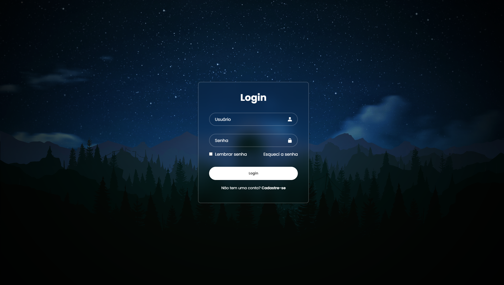

# Tela de Login Responsiva

Uma interface de login moderna, estilosa e responsiva, com animações sutis e um visual clean. Ideal para aplicações web que buscam causar uma ótima primeira impressão. Pretendo usar esse estilo como base para futuros projetos, mantendo uma identidade visual consistente e profissional.

## 🧪 Tecnologias utilizadas

- HTML5
- CSS3
- Boxicons
- Google Fonts (Poppins + Inter)

## 💡 Funcionalidades

- Efeito de vidro com `backdrop-filter`
- Responsivo para dispositivos móveis
- Ícones nos campos de input
- Botão com hover animado
- Design minimalista e elegante

